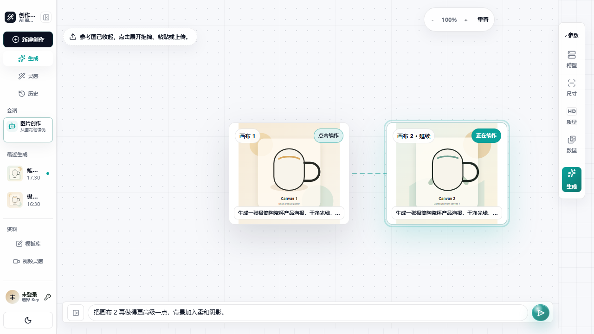
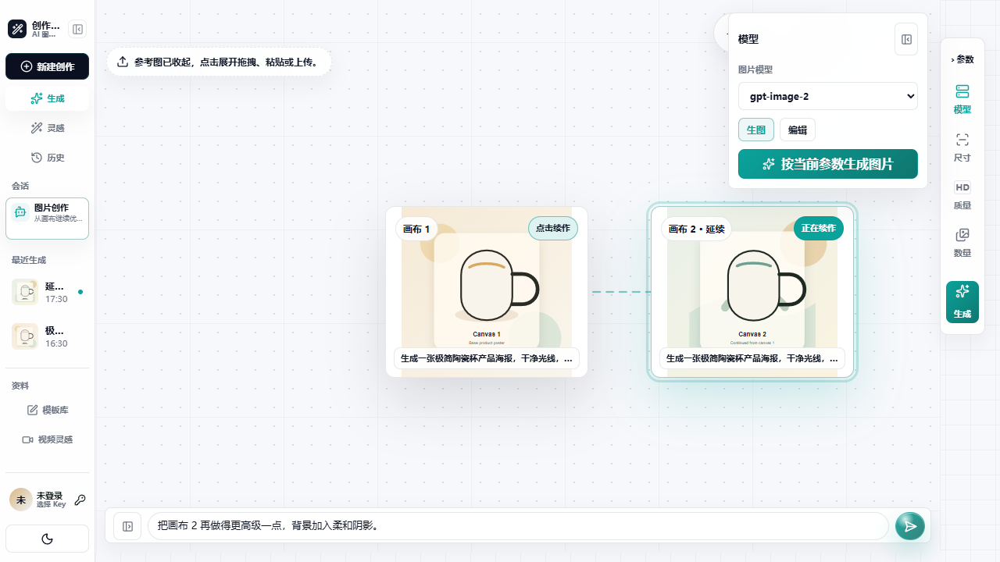
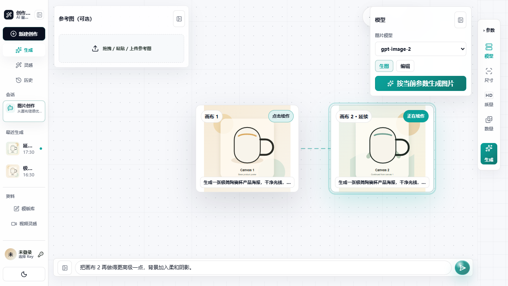
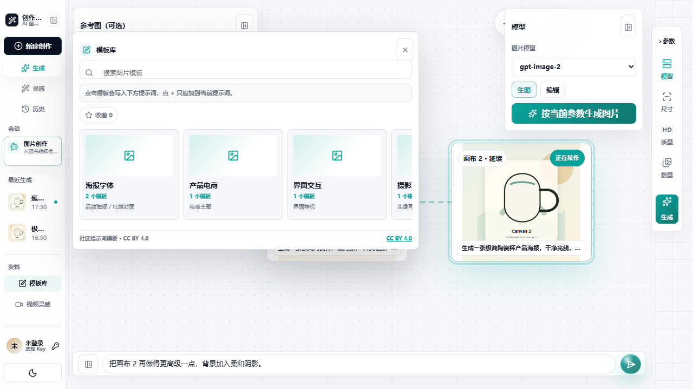
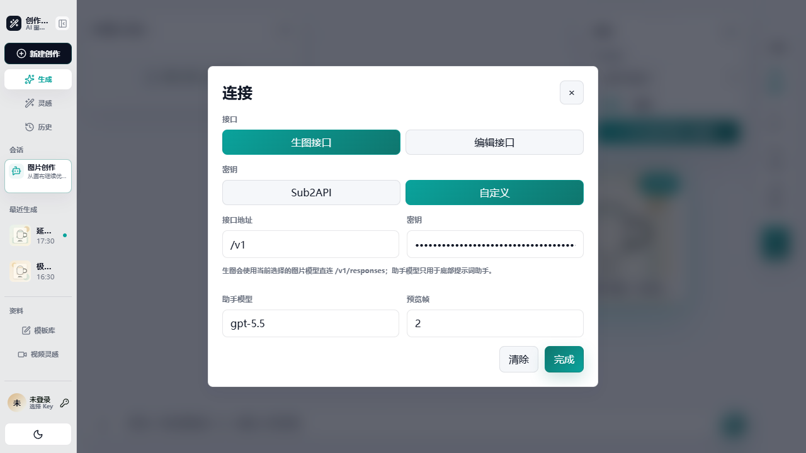
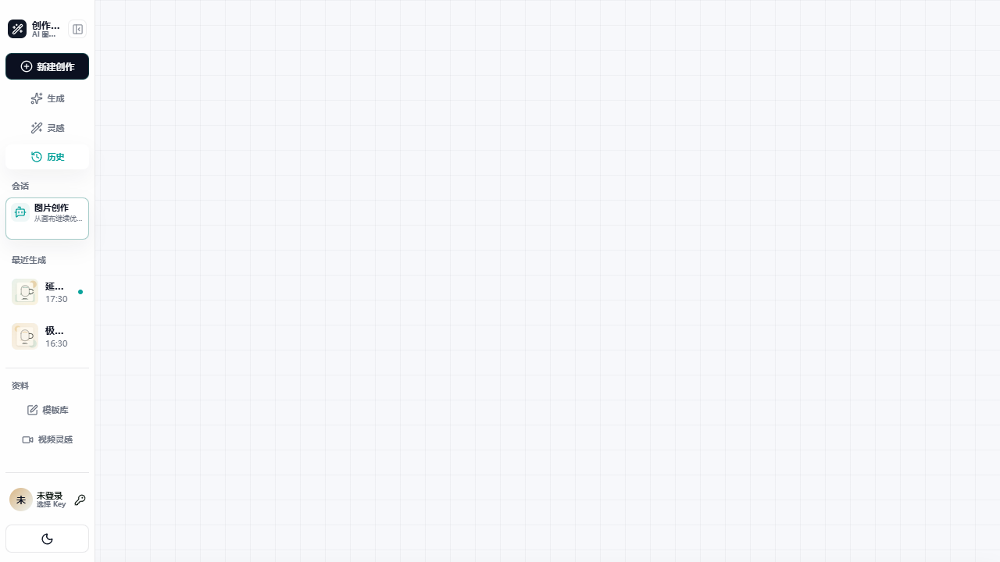

# image-sub2api-studio

I built `image-sub2api-studio` because Sub2API already solves the hard backend layer: models, keys, quota, billing, and OpenAI-compatible routes. What I wanted was a lighter creation workstation on top of it.

I did not want users to manually assemble image API payloads every time. I wanted prompt writing, reference images, model selection, quality settings, generation results, and history to live in one focused page. This project is that front-end layer.

`0.5.0` is the first version I feel comfortable sharing as a self-hostable learning and deployment artifact. It does not include my Oh Laoo home page or my full private image library. It only open-sources the Sub2API image studio.

Demo: [studio.ohlaoo.com/studio/](https://studio.ohlaoo.com/studio/)

<p align="center">
  <a href="https://github.com/margetrp-hub/image-sub2api-studio"></a>
  <a href="./LICENSE"></a>
  <a href="./README.zh-CN.md"></a>
</p>

## What 0.5 Does

- Image generation uses `/v1/responses` by default. Image models such as `gpt-image-2` are called directly instead of falling back to a text model plus an `image_generation` tool.
- Reference-image editing and mask redraw use `/v1/images/edits`.
- Sub2API keys can be selected in the UI, with masked display.
- Results stay in the current canvas and in history. Selecting a canvas node lets the next prompt continue from the previous image.
- Local Vite development can proxy `/v1`, `/api`, and `/login` to a cloud Sub2API endpoint to avoid browser CORS during real upstream tests.
- Image and video workspaces are separated. The video workspace is kept as a future extension surface.
- README, deployment notes, Docker/Nginx samples, asset-library boundaries, and acknowledgements have been cleaned up for release.

## Screenshots

Screenshots come from the current 0.5 workspace and use demo data with masked keys.














## Boundary

This repository is not Sub2API itself and not a model gateway.

Sub2API owns accounts, keys, quota, models, billing, and OpenAI-compatible gateway routes.

`image-sub2api-studio` owns the creation UI: prompts, reference upload, parameter controls, canvas continuation, history, and deployment samples.

Community prompt templates are used as learning/reference material. Where applicable, prompt template content follows `CC BY 4.0`; keep attribution to original authors or sources when using or adapting it. See [Acknowledgements and Reference Boundaries](docs/ACKNOWLEDGEMENTS.md).

## Local Run

```bash
npm install
cp .env.example .env.local
npm run dev:studio
```

For local testing against a cloud Sub2API endpoint:

```env
VITE_DEV_SUB2API_PROXY_TARGET=https://your-sub2api-domain
```

This lets the local page call `/v1`, `/api`, and `/login` through the Vite dev server instead of being blocked by browser CORS.

## Production Build

Root path:

```bash
npm run build
```

`/studio/` subpath:

```bash
STUDIO_BASE_PATH=/studio/ npm run build
```

Windows PowerShell:

```powershell
$env:STUDIO_BASE_PATH="/studio/"
npm run build
Remove-Item Env:\STUDIO_BASE_PATH
```

Upload the files from `dist/`. Do not upload the source-root `studio.html` directly, because the production file must be the built `dist/studio.html`.

## Minimum Environment

```env
VITE_SUB2API_BASE_URL=https://sub2api.example.com
VITE_SUB2API_GATEWAY_BASE_URL=https://sub2api.example.com
VITE_SUB2API_IMAGE_ROUTE=responses
VITE_SUB2API_RESPONSES_MODEL=gpt-5.5
VITE_SUB2API_LOGIN_URL=https://studio.example.com/login
VITE_STUDIO_HISTORY_BASE_URL=https://studio.example.com
VITE_STUDIO_BACK_URL=/
VITE_STUDIO_LIBRARY_AUTH_REQUIRED=false
VITE_DEV_SUB2API_PROXY_TARGET=https://sub2api.example.com
```

Notes:

- `VITE_SUB2API_BASE_URL` is normalized to `/api/v1` for login, profile, and key-list APIs.
- `VITE_SUB2API_GATEWAY_BASE_URL` is normalized to `/v1` for model and generation routes.
- `VITE_SUB2API_IMAGE_ROUTE=responses` is the recommended mode for this release.
- `legacy` is kept only for `/v1/images/generations` compatibility.
- Set `VITE_STUDIO_LIBRARY_AUTH_REQUIRED=true` only after the authenticated `/studio-api/library` service is available.

## VPS Layout

I usually deploy it as static front-end files plus an optional history service:

```text
/var/www/image-sub2api-studio/    # Static files
/opt/image-sub2api-studio/        # Optional Node history service
/var/lib/image-sub2api-studio/    # User history and protected library assets
```

More details:

- [Deployment guide](docs/DEPLOY.zh-CN.md)
- [Docker guide](docs/DOCKER.zh-CN.md)
- [Server update guide](deploy/UPDATE-SERVER.zh-CN.md)

If the server already has an image library, normal updates only need the core package:

```bash
node scripts/package-studio-core-update.mjs
```

## Asset Library Strategy

Anything already loaded by front-end code can be inspected in the browser. For production deployments where prompts and assets should not be scraped, I recommend:

- Keep the GitHub repository lightweight and do not include the full private gallery.
- Serve private prompts and assets through `/studio-api/library` after login.
- Block static access to `/studio/images/`, `/studio/cases.json`, and `/studio/inspirations.json` in Nginx.
- Add `X-Robots-Tag: noindex, nofollow, noarchive`.

The repository includes a starting Nginx example in `deploy/nginx-sub2api-studio.conf`.

## Sub2API Contract Check

```bash
SUB2API_BASE_URL=https://sub2api.example.com \
SUB2API_EMAIL=you@example.com \
SUB2API_PASSWORD='your-password' \
npm run check:sub2api
```

This checks login, profile, and key-list behavior. It does not start paid generation.

## Project Structure

```text
.
├── src/
│   ├── studio.jsx                         # Main studio UI
│   ├── studio.css                         # Studio styles
│   ├── sub2apiClient.js                   # Sub2API / OpenAI-compatible client
│   └── studio/                            # Helpers and local storage utilities
├── scripts/
│   ├── image-sub2api-studio-history-service.mjs
│   ├── check-sub2api-contract.mjs
│   └── package-studio-core-update.mjs
├── deploy/
│   ├── nginx-sub2api-studio.conf
│   ├── docker-nginx.conf
│   ├── image-sub2api-studio-history.service
│   └── UPDATE-SERVER.zh-CN.md
├── docs/
│   ├── DEPLOY.zh-CN.md
│   ├── DOCKER.zh-CN.md
│   ├── open-source-config.zh-CN.md
│   ├── sub2api-studio-overlay.md
│   ├── templates.md
│   └── screenshots/
├── public/
│   ├── cases.json
│   ├── inspirations.json
│   ├── inspiration-sources.json
│   └── style-library.json
└── studio.html
```

## Author & License

Maintainer: [@margetrp-hub](https://github.com/margetrp-hub)

Code is released under the [MIT License](LICENSE). Prompt template content comes from community sources and follows `CC BY 4.0` where applicable.
