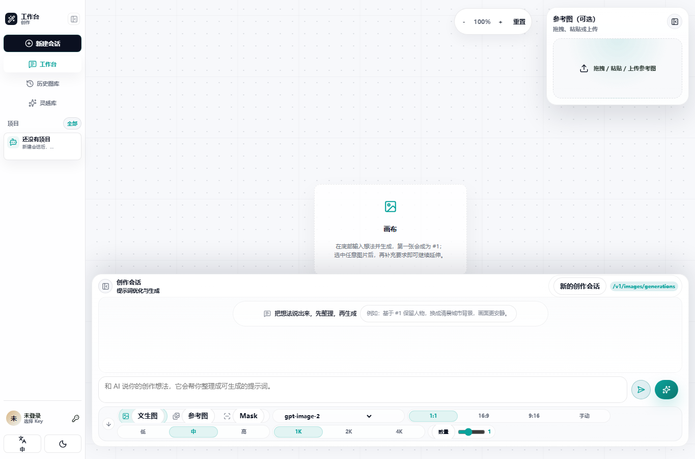
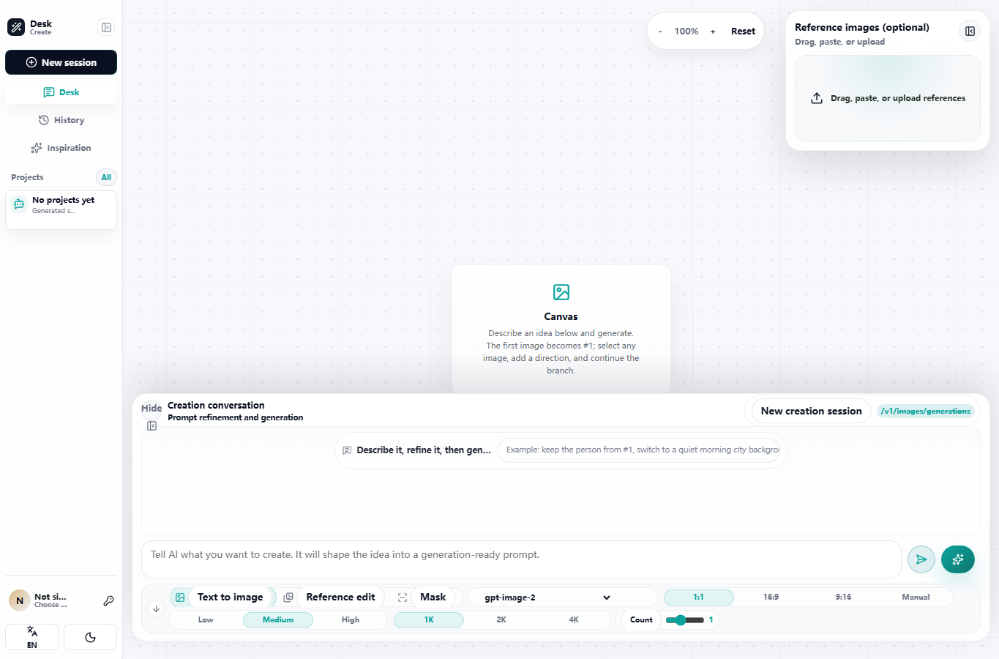

# Image Agent Studio

我做 Image Agent Studio，是因为生图工作流很容易被拆散：提示词在一个地方，参考图在另一个地方，参数藏在请求里，生成结果刷新后又可能丢，上下文和分支关系也很难追。

这个项目想把这些东西放回一个稳定工作区：写需求、挂参考图、选模型路线、生成或编辑、把结果留在画布上，并且能从任意一张图继续往下做，不丢提示词、Mask、参数、分支和历史。

核心项目 **不依赖 Sub2API 或 NewAPI**。它们只是可选的适配器/网关形态。工作站本身可以连接官方 OpenAI 风格接口、自定义 OpenAI 兼容接口、NewAPI 兼容部署、Sub2API 兼容部署，以及未来的图片、视频模型适配器。

演示入口：[studio.ohlaoo.com/studio/](https://studio.ohlaoo.com/studio/)

English README: [README.md](./README.md)

## 交流

如果你也在做 AI 生图工作流、提示词工作流、OpenAI 兼容接口、自定义模型网关、NewAPI、Sub2API、Docker 部署或后续视频创作工作站，欢迎加入 QQ 交流群：`260789529`。

## 中文搜索关键词

AI 图像工作站、AI 生图工作台、图片生成工作流、提示词工作流、参考图生图、Mask 局部重绘、OpenAI 兼容接口、NewAPI 适配、Sub2API 适配、自托管生图平台、AI 创作画布、图片历史图库、图像生成队列、视频创作工作站。

## 当前能力

- 文生图默认使用 `POST /v1/images/generations`。
- 参考图编辑和 Mask 局部重绘使用 `POST /v1/images/edits`。
- 提示词助手使用 `POST /v1/chat/completions`。
- `/v1/responses` 只作为显式兼容路径，不再作为默认生图路径。
- 新配置优先使用 `VITE_AI_*` 和 `AI_GATEWAY_*`。
- 旧的 `VITE_SUB2API_*` 和 `SUB2API_*` 仍作为兼容别名，方便旧部署平滑升级。
- Docker 可以使用 `STUDIO_AUTH_MODE=local` 独立运行，不需要上游账号系统也能保存历史、会话、队列和生成图片。
- 已有账号系统的部署可以使用 `STUDIO_AUTH_MODE=gateway`，通过上游网关做用户隔离。
- 服务端生成任务通过 `/studio-api/generation-jobs` 持久化。
- 当前画布会话通过 `/studio-api/session` 持久化。
- 浏览器刷新或服务重启后，可以恢复历史图库、当前会话、队列状态和已保存图片。
- 历史图库、模板库、灵感库采用分批渲染，减少图片多时的浏览器压力。
- 手动输入的 Provider API Key 只保存在当前浏览器会话，不写入长期 localStorage。
- 左下角支持中英文切换和明暗主题切换。

## 边界说明

这个仓库刻意只做工作站这一层。它不是模型供应商、不是账号池、不是计费系统、不是网关后端。

Image Agent Studio 负责：

- 创作工作台界面。
- 提示词、参考图和 Mask 工作流。
- Provider 选择与路由规划。
- 无限画布和图片分支关系。
- 当前会话持久化。
- 历史图库和生成图片资产保存。
- Docker、Nginx、VPS 部署示例。

你的官方 API、NewAPI、Sub2API 或自定义网关负责：

- 账号和 API Key。
- 模型可用性。
- 额度与计费。
- 上游路由、重试和失败处理。
- Provider 自己的内容策略和审核行为。

更多边界见 [SECURITY.md](./SECURITY.md) 和 [docs/PROVIDERS.md](./docs/PROVIDERS.md)。

## 截图

截图使用演示数据，Key 已打码。





## 本地运行

```bash
npm install
cp .env.example .env.local
npm run dev:studio
```

如果本地要测试真实云端网关，可以在 `.env.local` 里配置：

```env
VITE_DEV_AI_GATEWAY_PROXY_TARGET=https://your-gateway-domain
```

这样本地页面请求 `/v1`、`/api` 和 `/login` 时会经过 Vite 代理，避免浏览器 CORS 问题。

## 生产构建

部署在根路径：

```bash
npm run build
```

部署在 `/studio/` 子路径：

```bash
STUDIO_BASE_PATH=/studio/ npm run build
```

Windows PowerShell：

```powershell
$env:STUDIO_BASE_PATH="/studio/"
npm run build
Remove-Item Env:\STUDIO_BASE_PATH
```

上线时上传 `dist/` 里的文件，不要直接上传源码根目录的 `studio.html`。

## 最小环境变量

```env
VITE_AI_GATEWAY_BASE_URL=https://gateway.example.com
VITE_AI_GATEWAY_MODEL_BASE_URL=https://gateway.example.com
VITE_AI_IMAGE_ROUTE=auto
VITE_AI_RESPONSES_MODEL=gpt-5.5
VITE_AI_GATEWAY_LOGIN_URL=https://studio.example.com/login
VITE_STUDIO_HISTORY_BASE_URL=https://studio.example.com
VITE_STUDIO_BACK_URL=/
VITE_STUDIO_LIBRARY_AUTH_REQUIRED=false
VITE_DEV_AI_GATEWAY_PROXY_TARGET=https://gateway.example.com
```

说明：

- `VITE_AI_GATEWAY_BASE_URL` 用于登录、用户资料和 Key 列表。
- `VITE_AI_GATEWAY_MODEL_BASE_URL` 用于 `/v1/models`、图片生成、图片编辑和提示词助手。
- `VITE_AI_IMAGE_ROUTE=auto` 会让文生图走 `/v1/images/generations`，参考图和 Mask 走 `/v1/images/edits`。
- 只有上游明确支持 `/v1/responses` 生图时，才把 `VITE_AI_IMAGE_ROUTE` 改成 `responses`。
- `VITE_STUDIO_LIBRARY_AUTH_REQUIRED=true` 只适合已经接好 `/studio-api/library` 鉴权素材库的生产环境。

## 标准 VPS 目录

新的独立部署建议使用：

```text
/opt/image-agent-studio-repo/     # Git 仓库 checkout
/var/www/image-agent-studio/      # 构建后的静态文件
/opt/image-agent-studio/          # Node 历史/会话服务
/var/lib/image-agent-studio/      # 历史、会话、队列、生成图片和受保护素材库
```

已有 VPS 可以继续沿用旧路径，例如 `/var/www/ohlaoo-studio`、`/opt/image-sub2api-studio`、`/var/lib/image-sub2api-studio`。更新时显式传入这些路径即可，避免旧历史、队列、生成图片和受保护素材库因为更名而看起来丢失。

新服务器第一次安装：

```bash
sudo REPO_URL=https://github.com/margetrp-hub/image-agent-studio.git \
  BRANCH=main \
  bash -c 'git clone --branch "$BRANCH" "$REPO_URL" /opt/image-agent-studio-repo && bash /opt/image-agent-studio-repo/deploy/install.sh'
```

标准 Git 同步更新：

```bash
cd /opt/image-agent-studio-repo
sudo bash deploy/upgrade.sh
```

旧 Oh Laoo VPS 保留当前路径的更新方式：

```bash
cd /opt/image-agent-studio-repo

sudo BRANCH=main \
  REPO_DIR=/opt/image-agent-studio-repo \
  STATIC_DIR=/var/www/ohlaoo-studio \
  SERVICE_DIR=/opt/image-sub2api-studio \
  DATA_DIR=/var/lib/image-sub2api-studio \
  SERVICE_NAME=image-sub2api-studio-history \
  BASE_PATH=/studio/ \
  PUBLIC_STUDIO_URL=https://studio.ohlaoo.com/studio/ \
  REQUIRE_LIBRARY=1 \
  bash deploy/sync-from-git.sh
```

相关文档：

- [部署指南](docs/DEPLOY.zh-CN.md)
- [Docker 生产部署](docs/DOCKER.zh-CN.md)
- [VPS 直接同步 Git 仓库部署](docs/VPS-GIT-SYNC.zh-CN.md)
- [服务器更新说明](deploy/UPDATE-SERVER.zh-CN.md)
- [Provider 和适配器说明](docs/PROVIDERS.md)
- [Release Notes](RELEASE_NOTES.md)

## Release 包

生产环境优先使用 Git 同步。无法直接从 GitHub 拉取时，可以生成 zip 包：

```bash
npm run package:release
```

会生成：

- `image-agent-studio-core-update-*.zip`：静态前端文件。
- `image-agent-studio-service-update-*.zip`：服务脚本和部署文档，标准目标目录是 `/opt/image-agent-studio`。

## Docker 部署

Docker Compose 会启动两个容器：

- `studio-web`：Nginx 静态前端和同源代理。
- `studio-history`：历史图库、当前会话、任务队列和生成图片资产持久化服务。

```bash
cp .env.example .env
docker compose up --build -d
```

默认访问：

```text
http://localhost:8080/studio/
```

持久化数据保存在 `studio-data` volume。不要执行 `docker compose down -v`，除非你明确要删除历史图库、队列和生成图片。

宿主机上已有 OpenAI 兼容网关时：

```env
AI_GATEWAY_UPSTREAM=http://host.docker.internal:8080
```

远程网关：

```env
AI_GATEWAY_UPSTREAM=https://your-gateway-domain
```

完整说明见 [docs/DOCKER.zh-CN.md](./docs/DOCKER.zh-CN.md)。

## Windows 桌面 EXE

仓库现在提供可复现的 Windows 桌面打包路径。它会先构建前端，再用 Electron 启动本地历史/会话服务和本地静态服务器，最后以桌面窗口打开工作站。

```bash
npm run package:windows
```

产物会写到：

```text
release/desktop/
```

`.exe` 是 release 产物，不应该提交进 Git 仓库。发布时把它上传到 GitHub Releases。更多见 [Windows 桌面打包说明](docs/WINDOWS-DESKTOP.zh-CN.md)。

## 验证

不消耗生图额度的本地检查：

```bash
npm run check:local
```

部署相关的快速检查：

```bash
npm run check:deploy
npm run check:docker
npm run check:env
npm run check:docs
npm run check:studio-build
```

Docker 可用时：

```bash
npm run smoke:docker
```

Provider 路由检查：

```bash
npm run check:providers
```

账号型网关合约检查，不会发起付费生图：

```bash
AI_GATEWAY_BASE_URL=https://gateway.example.com \
AI_GATEWAY_EMAIL=you@example.com \
AI_GATEWAY_PASSWORD='your-password' \
npm run check:gateway
```

## 项目结构

```text
src/
  aiGatewayClient.js                 # OpenAI 兼容网关客户端
  sub2apiClient.js                   # 旧导入路径兼容转发
  studio.jsx                         # 主工作台 UI
  studio/                            # Provider、存储、错误和工作流工具
scripts/
  image-agent-studio-history-service.mjs
  image-sub2api-studio-history-service.mjs
  package-release.mjs
deploy/
  image-agent-studio-history.service
  nginx-image-agent-studio.conf
  sync-from-git.sh
  install.sh / upgrade.sh / backup.sh / restore.sh / self-check.sh
docs/
  PROVIDERS.md
  DEPLOY.zh-CN.md
  DOCKER.zh-CN.md
  VPS-GIT-SYNC.zh-CN.md
public/
  cases.json
  inspirations.json
  inspiration-sources.json
  style-library.json
```

## 授权

代码使用 [MIT License](LICENSE)。社区提示词模板在适用时遵循 `CC BY 4.0`。第三方依赖、提示词来源、用户自行接入的素材库和外部 Provider 服务遵循各自的许可证或服务条款。
